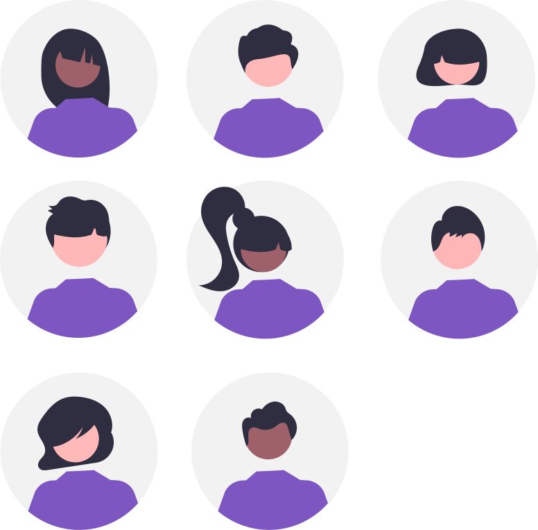

## Avertissement :

[{: align=left width=10%}](){target=_blank}[{: align=right width=10%}](mailto:){target=_blank}Ce site s'adresse au groupe des élèves de première du lycée Notre Dame du Mur qui suivent l'enseignement de spécialité Numérique et Sciences Informatiques.
<!-- 
### Autres liens du groupe :

- [Sharepoint](https://ecmorlaix.sharepoint.com/sites/TEAM-1NSI-20212022/Documents%20partages/Forms/AllItems.aspx?CT=1633088990185&RootFolder=%2Fsites%2FTEAM%2D1NSI%2D20212022%2FDocuments%20partages%2FGeneral&FolderCTID=0x012000019689D1FEC0FB4E86F4D05CA2B5A0EC){target=_blank}
- [Conversation](https://outlook.office365.com/mail/group/ecmorlaix.fr/team-tnsi-20222023/email){target=_blank} -->

***

{: .center width=50%}

[mail]: mailto:eric.madec@ecmorlaix.fr "eric.madec@ecmorlaix.fr"

***
<!-- 
**A LIRE :**

- [ChatGPT : « Non, le métier de développeur informatique n’est pas mort ! ](https://www.nouvelobs.com/opinions/20230321.OBS71149/chatgpt-non-le-metier-de-developpeur-informatique-n-est-pas-mort.html){target=_blank}

- [Sortir de sa zone de confort pour apprendre afin de se réaliser](https://static.wixstatic.com/media/557f79_7cbdd28074e84e4882ec9314f46d5fb0~mv2.jpeg/v1/fill/w_1024,h_768,al_c,q_90/557f79_7cbdd28074e84e4882ec9314f46d5fb0~mv2.webp){target=_blank} ;
     source : <https://www.jeromefrugere.com/post/pourquoi-dit-on-qu-il-faut-se-faire-violence-pour-sortir-de-sa-zone-de-confort>

***

## Du 28/03 :

=== "CONTENU DE SÉANCE"

    - Les graphes :

        - **regarder** la vidéo suivante :
        
        <iframe width="560" height="315" src="https://www.youtube-nocookie.com/embed/YYv2R1cCTa0" title="YouTube video player" frameborder="0" allow="accelerometer; autoplay; clipboard-write; encrypted-media; gyroscope; picture-in-picture" allowfullscreen></iframe>

        - **lire** le [cours](https://dav74.github.io/site_nsi_term/c9c/){target=_blank} et **faire** les [activités](https://dav74.github.io/site_nsi_term/c9a/){target=_blank} proposés par David ROCHE ;
        - **faire** les activités du notebook [Graphes_avec_networkx](https://nbviewer.org/urls/ericecmorlaix.github.io/TNSI_2025-2026/SD/Graphes_avec_networkx.ipynb){target=_blank} [:fontawesome-solid-download:](https://ericecmorlaix.github.io/TNSI_2025-2026/SD/Graphes_avec_networkx.ipynb){ .md-button .md-button--primary} ;
        - **faire** les activités du notebook [Graphes_avec_graphviz](https://nbviewer.org/urls/ericecmorlaix.github.io/TNSI_2025-2026/SD/Graphes_avec_graphviz.ipynb){target=_blank} [:fontawesome-solid-download:](https://ericecmorlaix.github.io/TNSI_2025-2026/SD/Graphes_avec_graphviz.ipynb){ .md-button .md-button--primary};
        - **lire** le [cours](https://dav74.github.io/site_nsi_term/c10c/){target=_blank} et **faire** les [activités](https://dav74.github.io/site_nsi_term/c10a/){target=_blank} puis les [exercices](https://dav74.github.io/site_nsi_term/c10e/){target=_blank} proposés par David ROCHE ;
        - **faire** les activités du notebook [Graphes_parcours_applications](https://nbviewer.org/urls/ericecmorlaix.github.io/TNSI_2025-2026/SD/Graphes_parcours_applications.ipynb){target=_blank} [:fontawesome-solid-download:](https://ericecmorlaix.github.io/TNSI_2025-2026/SD/Graphes_parcours_applications.ipynb){ .md-button .md-button--primary} ;

       

***
Liens utiles pour des révisions de l'épreuve écrite :

- [https://pixees.fr/informatiquelycee/term/](https://pixees.fr/informatiquelycee/term/){target=_blank}
- [https://e-nsi.forge.aeif.fr/-/ecrit/ _/!\ préversion_](https://e-nsi.forge.aeif.fr/-/ecrit/-/jobs/9986/artifacts/public/2023/index.html){target=_blank}
- [https://toutmonexam.fr/](https://toutmonexam.fr/){target=_blank}

***
## Du 15/03

=== "Révisions à partir des sujets 2023"

    - [Centres étranger J1](./SE/spe_numerique_informatique_2023_centres_etranger_1_sujet_officiel.pdf){target=_blank}
    - [Centres étranger J2](./SE/spe_numerique_informatique_2023_centres_etranger_2_sujet_officiel.pdf){target=_blank}
    - [Polynésie J1](./SE/spe_numerique_informatique_2023_polynesie_1_sujet_officiel.pdf){target=_blank}
    - [Polynésie J2](./SE/spe_numerique_informatique_2023_polynesie_2_sujet_officiel.pdf){target=_blank}

=== "Propositions de correction partagées"

    - [Centres étranger J1](){target=_blank}
    - [Centres étranger J2](){target=_blank}
    - [Polynésie J1](){target=_blank}
    - [Polynésie J2](){target=_blank}

***
## Du 19/01 

=== "CONTENU DE SÉANCE"
    
    - **Faire** les activités ​du notebook [SoC_Processus](https://nbviewer.org/urls/ericecmorlaix.github.io/TNSI_2025-2026/MR/SoC_Processus.ipynb){target=_blank}  [:fontawesome-solid-download:](https://ericecmorlaix.github.io/TNSI_2025-2026/MR/SoC_Processus.ipynb){ .md-button .md-button--primary} ;
    - **appliquer** à l'[Exercice sur l'OS et les Processus)](./MR/ExerciceProcessus.pdf)
    

    !!! info "Epreuve Pratique"

        ==L'épreuve pratique aura lieu au lycée dans la matinée du mercredi 15 mars.==

        Les 45 sujets officiels publics sont visibles à l'adresse : [https://cyclades.education.gouv.fr/delos/public/listPublicECE](https://cyclades.education.gouv.fr/delos/public/listPublicECE){target=_blank}. 

=== "TRAVAIL À FAIRE"

    - **Réaliser** dans Obsidian avec le module complémentaire [Spaced Repetition](https://www.stephenmwangi.com/obsidian-spaced-repetition/){target=_blank} des[flashcards partagées](https://codimd.apps.education.fr/0UgUuDUrTE-V9cVZ046x9Q){target=_blank} pour réviser...
    - S'entrainer (==conserver des traces de tous vos exercices dans des `note.md` et/ou des `notebook.ipynb`==) : 
        - encore [sur les bases de données et le langage SQL](https://e-nsi.forge.aeif.fr/exercices_bdd/){target=_blank} ;
        - à la programmation en Python pour l'[épreuve pratique](https://e-nsi.forge.aeif.fr/pratique/){target=_blank} et au-delà...;

***
## Du 04 au 13/01 

=== "CONTENU DE SÉANCE"

    - Réalisation dans Obsidian avec le module complémentaire [Spaced Repetition](https://www.stephenmwangi.com/obsidian-spaced-repetition/){target=_blank} de [flashcards partagées](https://codimd.apps.education.fr/0UgUuDUrTE-V9cVZ046x9Q){target=_blank} pour réviser...

    - Pour s'entrainer encore [sur les bases de données et le langage SQL](https://e-nsi.forge.aeif.fr/exercices_bdd/){target=_blank} ;

    - **Regarder** la vidéo [les arbres binaires de recherche](https://revoir.tv5monde.com/toutes-les-videos/culture/les-cours-lumni-lycee-cours-du-11-12-2020-3){target=_blank} ;

    - **Lire** et **Faire** les activités ​du notebook [Structure_Arborescente](https://nbviewer.org/urls/ericecmorlaix.github.io/TNSI_2025-2026/SD/Structure_Arborescente.ipynb){target=_blank}  [:fontawesome-solid-download:](https://ericecmorlaix.github.io/TNSI_2025-2026/SD/Structure_Arborescente.ipynb){ .md-button .md-button--primary} ;

    - **faire** l'[exercice 1](./SD/Exercice_1-arbres.pdf) ;

    - **faire** l'[exercice 2](./SD/Exercice_2-arbres.pdf) ; 

    - en prévision du Bac Blanc, **faire** les exercices 3, 4 et 5 [extraits du bac blanc 2022](./SE/extraits_bac-blanc-2022.pdf) ;

=== "TRAVAIL À FAIRE"
    - **Rendre** les travaux de mémo SQL et [SQL-Exercice_Bibliotheque](./BD/SQL-Exercice_Bibliotheque.pdf){target=_blank} ;
   

***
 
## Du 02 au 16/12

=== "CONTENU DE SÉANCE"

    - **Regarder** la vidéo et **répondre** aux questions de cette [introduction aux BDR](http://colbert.bzh/sql/tp.html?html=intro){target=_blank} ;
    - **S'inscrire** sur la Khan Academy et **rejoindre** [la classe TNSI_2025-2026 code VG34RDPG](https://fr.khanacademy.org/join/VG34RDPG){target=_blank} pour faire les activités d'initiation à la programmation en langage [SQL](https://fr.khanacademy.org/computing/computer-programming/sql){target=_blank} ;
    - **Faire** les activités ​du notebook [SQL-Structured_Query_Language](https://nbviewer.org/urls/ericecmorlaix.github.io/TNSI_2025-2026/BD/SQL-Structured_Query_Language.ipynb){target=_blank}  [:fontawesome-solid-download:](https://ericecmorlaix.github.io/TNSI_2025-2026//BD/SQL-Structured_Query_Language.ipynb){ .md-button .md-button--primary} ;
    - **Lire** le notebook [BDR-Bases_de_Donnees_Relationnelles](https://nbviewer.org/urls/ericecmorlaix.github.io/TNSI_2025-2026/BD/BDR-Bases_de_Donnees_Relationnelles.ipynb){target=_blank}  [:fontawesome-solid-download:](https://ericecmorlaix.github.io/TNSI_2025-2026//BD/BDR-Bases_de_Donnees_Relationnelles.ipynb){ .md-button .md-button--primary} ;
    - **Regarder** les vidéos :
        - [Qu'est ce qu'une base de donnees relationnelle ?](https://www.lumni.fr/video/qu-est-ce-qu-une-base-de-donnees-relationnelle){target=_blank} ;
        - [Interrogation d'une base de donnees relationnelle](https://www.lumni.fr/video/interrogation-d-une-base-de-donnees-relationnelle){target=_blank} ;
    - **Faire** [SQL-Exercice_Bibliotheque](./BD/SQL-Exercice_Bibliotheque.pdf){target=_blank} ;
    - **S'entrainer** encore sur les sites :
        - [https://fxjollois.github.io/cours-sql/](https://fxjollois.github.io/cours-sql/){target=_blank} ;
        - [https://sqlzoo.net/wiki/SQL_Tutorial](https://sqlzoo.net/wiki/SQL_Tutorial){target=_blank} ;

## Le 01/12

=== "CONTENU DE SÉANCE"
    
    - Correction [tours de Hanoï partie C](https://nbviewer.org/urls/ericecmorlaix.github.io/TNSI_2025-2026/SD/ds2-Partie_Pratique_C-Complet.ipynb){target=_blank}  [:fontawesome-solid-download:](https://ericecmorlaix.github.io/TNSI_2025-2026/SD/ds2-Partie_Pratique_C-Complet.ipynb){ .md-button .md-button--primary} ;
    - **Finir de compléter** la proposition de correction pour [l'évaluation pratique : une tortue récursive](https://nbviewer.org/urls/ericecmorlaix.github.io/TNSI_2025-2026/LP/Une_tortue_recursive-Correction_et_Plus.ipynb){target=_blank}  [:fontawesome-solid-download:](https://ericecmorlaix.github.io/TNSI_2025-2026/LP/Une_tortue_recursive-Correction_et_Plus.ipynb){ .md-button .md-button--primary} ;

## Du 21 au 29/11

=== "CONTENU DE SÉANCE"

    - Evaluation pratique appliquées aux [tours de Hanoï partie B](https://nbviewer.org/urls/ericecmorlaix.github.io/TNSI_2025-2026/SD/ds2-Partie_Pratique_B.ipynb){target=_blank}  [:fontawesome-solid-download:](https://ericecmorlaix.github.io/TNSI_2025-2026/SD/ds2-Partie_Pratique_B.ipynb){ .md-button .md-button--primary} ;
    - Evaluation pratique appliquées aux [tours de Hanoï partie C](https://nbviewer.org/urls/ericecmorlaix.github.io/TNSI_2025-2026/SD/ds2-Partie_Pratique_C.ipynb){target=_blank}  [:fontawesome-solid-download:](https://ericecmorlaix.github.io/TNSI_2025-2026/SD/ds2-Partie_Pratique_C.ipynb){ .md-button .md-button--primary} ;

=== "TRAVAIL À FAIRE"

 
    - **Rendre** progressivement par [mail] le travail réalisé sur les tours de Hanoï...
    
## Le 18/11

=== "CONTENU DE SÉANCE"

    - Evaluation pratique appliquées aux [tours de Hanoï partie A](https://nbviewer.org/urls/ericecmorlaix.github.io/TNSI_2025-2026/SD/ds2-Partie_Pratique_A.ipynb){target=_blank}  [:fontawesome-solid-download:](https://ericecmorlaix.github.io/TNSI_2025-2026/SD/ds2-Partie_Pratique_A.ipynb){ .md-button .md-button--primary} ;
    - Evaluation pratique : [une tortue récursive](https://nbviewer.org/urls/ericecmorlaix.github.io/TNSI_2025-2026/LP/Une_tortue_recursive.ipynb){target=_blank}  [:fontawesome-solid-download:](https://ericecmorlaix.github.io/TNSI_2025-2026/LP/Une_tortue_recursive.ipynb){ .md-button .md-button--primary} ;

=== "TRAVAIL À FAIRE"

    

    

***
## Le 15/11

=== "CONTENU DE SÉANCE"

    - **Finir** la [programmation récursive](https://nbviewer.org/urls/ericecmorlaix.github.io/TNSI_2025-2026/LP/Recursif.ipynb){target=_blank}  [:fontawesome-solid-download:](https://ericecmorlaix.github.io/TNSI_2025-2026/LP/Recursif.ipynb){ .md-button .md-button--primary} ;
    - **Analyser** la proposition de correction du notebook [Liste](https://nbviewer.org/urls/ericecmorlaix.github.io/TNSI_2025-2026/SD/Structure_Lineaire-Liste-Complet.ipynb){target=_blank}  [:fontawesome-solid-download:](https://ericecmorlaix.github.io/TNSI_2025-2026/SD/Structure_Lineaire-Liste-Complet.ipynb){ .md-button .md-button--primary} ;    
    - **Lire** la [proposition de correction](./SD/Corrections-Evaluation_POO-DM_Liste) de l'évaluation de POO et **Compléter** celle sur les listes chainées ;
    - **Lire** la [correction](./SD/Correction-DM_Pile_File.pdf) du DM sur les Piles et Files ;
    - Synthèse [programmation récursive](https://glassus.github.io/terminale_nsi/T2_Programmation/2.2_Recursivite/cours/){target=_blank} et [structure linéaire Liste, Pile et File](https://glassus.github.io/terminale_nsi/T1_Structures_de_donnees/1.1_Listes_Piles_Files/cours/){target=_blank} ;

***
## Les 20 et 21/10 (2h + 1h)

=== "CONTENU DE SÉANCE"

    - Synthèse de [Liste](https://nbviewer.org/urls/ericecmorlaix.github.io/TNSI_2025-2026/SD/Lucien_Structure_Lineaire-Liste.ipynb){target=_blank}  [:fontawesome-solid-download:](https://ericecmorlaix.github.io/TNSI_2025-2026/SD/Lucien_Structure_Lineaire-Liste.ipynb){ .md-button .md-button--primary} ;
    
    - [Evaluation sur la POO et les listes chainées](./SD/Eval_POO_Liste.pdf){target=_blank}  le 20/10.

***

!!! info "Informations pour le bac"

    - ==L'épreuve pratique aura lieu au lycée dans la matinée du mercredi 12 juin.==
    - [Banque des sujets d'Epreuve Pratique 2024](https://cyclades.education.gouv.fr/delos/public/listPublicECE){target=_blank} ;
    - [Nouveau site pour s'exercer à l'épreuve pratique](https://codex.forge.apps.education.fr/){target=_blank} sans oublier pour autant [l'ancien](https://e-nsi.forge.aeif.fr/pratique){target=_blank} ;
    - [Et toujours pour se préparer à l'érit](https://e-nsi.forge.aeif.fr/ecrit/){target=_blank}.

***

## Le 28/05 

=== "CONTENU DE SÉANCE"
    
    - Correction du [BB2](./SU/BB2_NSI_23-24.pdf){target=_blank} ;

    - **Revoir** la [notion de complexité et les algorithmes de tris](https://e-nsi.forge.aeif.fr/tris/){target=_blank} ;

    - **Travailler** la notion de programmation dynamique à l'[écrit](./SU/bac_nsi_2024_sujet0b.pdf){target=_blank} et en [pratique](https://codex.forge.apps.education.fr/recherche/){target=_blank} ;
    
  
=== "TRAVAIL À FAIRE"

   - **S'entrainer** (==conserver des traces de tous vos exercices dans des `note.md` et/ou des `notebook.ipynb`==) : 
        - encore [sur les bases de données et le langage SQL](https://e-nsi.forge.aeif.fr/exercices_bdd/){target=_blank} ;
        - à la programmation en Python pour l'[épreuve pratique](https://codex.forge.apps.education.fr/){target=_blank} et [au-delà](https://e-nsi.forge.aeif.fr/pratique){target=_blank} ;
        - pour l'[épreuve écrite](https://toutmonexam.fr/annee.php){target=_blank} : [24-NSIJ1AN1](./SU/spe_numerique_informatique_2024_amerique_nord_1_sujet_officiel.pdf){target=_blank} , [24-NSIJ2AN1](./SU/spe_numerique_informatique_2024_amerique_nord_2_sujet_officiel__1_.pdf){target=_blank}...

***

## Du 09/04 

=== "CONTENU DE SÉANCE"
    
    - **Faire** les activités ​du notebook [Algorithmique-Complexite](https://nbviewer.org/urls/ericecmorlaix.github.io/TNSI_2025-2026/AL/Algorithmique-Complexite.ipynb){target=_blank}  [:fontawesome-solid-download:](https://ericecmorlaix.github.io/TNSI_2025-2026/AL/Algorithmique-Complexite.ipynb){ .md-button .md-button--primary} ;

    - **Faire** les activités ​du notebook [Algorithmique-Tri](https://nbviewer.org/urls/ericecmorlaix.github.io/TNSI_2025-2026/AL/Algorithmique-Tri.ipynb){target=_blank}  [:fontawesome-solid-download:](https://ericecmorlaix.github.io/TNSI_2025-2026/AL/Algorithmique-Tri.ipynb){ .md-button .md-button--primary} ;

    - **Préparer** une présentation à l'oral de vos sujets respectifs pour le 07/05 ;
***

## Du 08/02 :

=== "CONTENU DE SÉANCE"

    - Les graphes :

        - **regarder** la vidéo suivante :
        
        <iframe width="560" height="315" src="https://www.youtube-nocookie.com/embed/YYv2R1cCTa0" title="YouTube video player" frameborder="0" allow="accelerometer; autoplay; clipboard-write; encrypted-media; gyroscope; picture-in-picture" allowfullscreen></iframe>

        - **lire** le [cours](https://dav74.github.io/site_nsi_term/c9c/){target=_blank} et **faire** les [activités](https://dav74.github.io/site_nsi_term/c9a/){target=_blank} proposés par David ROCHE ;
        - **faire** les activités du notebook [Graphes_avec_networkx](https://nbviewer.org/urls/ericecmorlaix.github.io/TNSI_2025-2026/SD/Graphes_avec_networkx.ipynb){target=_blank} [:fontawesome-solid-download:](https://ericecmorlaix.github.io/TNSI_2025-2026/SD/Graphes_avec_networkx.ipynb){ .md-button .md-button--primary} ;
        - **faire** les activités du notebook [Graphes_avec_graphviz](https://nbviewer.org/urls/ericecmorlaix.github.io/TNSI_2025-2026/SD/Graphes_avec_graphviz.ipynb){target=_blank} [:fontawesome-solid-download:](https://ericecmorlaix.github.io/TNSI_2025-2026/SD/Graphes_avec_graphviz.ipynb){ .md-button .md-button--primary};
        - **lire** le [cours](https://dav74.github.io/site_nsi_term/c10c/){target=_blank} et **faire** les [activités](https://dav74.github.io/site_nsi_term/c10a/){target=_blank} puis les [exercices](https://dav74.github.io/site_nsi_term/c10e/){target=_blank} proposés par David ROCHE ;
        - **faire** les activités du notebook [Graphes_parcours_applications](https://nbviewer.org/urls/ericecmorlaix.github.io/TNSI_2025-2026/SD/Graphes_parcours_applications.ipynb){target=_blank} [:fontawesome-solid-download:](https://ericecmorlaix.github.io/TNSI_2025-2026/SD/Graphes_parcours_applications.ipynb){ .md-button .md-button--primary} ;

***
    - Correction [Exercices sur le Routage](./MR/ExercicesRoutage.pdf) ;

    - **Reprendre** en main [ipycanvas](https://nbviewer.org/urls/ericecmorlaix.github.io/TNSI_2025-2026/ipycanvas-Le_BN_pour_dessiner.ipynb){target=_blank}  [:fontawesome-solid-download:](https://ericecmorlaix.github.io/TNSI_2025-2026/ipycanvas-Le_BN_pour_dessiner.ipynb){ .md-button .md-button--primary} ;
    - **Faire** les activités de [Fractals_trees_avec_ipycanvas](https://nbviewer.org/urls/ericecmorlaix.github.io/TNSI_2025-2026/Fractals_trees_avec_ipycanvas.ipynb){target=_blank}  [:fontawesome-solid-download:](https://ericecmorlaix.github.io/TNSI_2025-2026/Fractals_trees_avec_ipycanvas.ipynb){ .md-button .md-button--primary} ;
    - **Faire** les activités de [Let_it_snow](https://nbviewer.org/urls/ericecmorlaix.github.io/TNSI_2025-2026/Let_it_snow.ipynb){target=_blank}  [:fontawesome-solid-download:](https://ericecmorlaix.github.io/TNSI_2025-2026/Let_it_snow.ipynb){ .md-button .md-button--primary} ;
    - **Faire** les activités de [L-Systeme](https://nbviewer.org/urls/ericecmorlaix.github.io/TNSI_2025-2026/L-Systeme.ipynb){target=_blank}  [:fontawesome-solid-download:](https://ericecmorlaix.github.io/TNSI_2025-2026/L-Systeme.ipynb){ .md-button .md-button--primary} ;  

    - **S'entrainer avec Pyxel pour la Nuit du c0de** : [POOng-Le_TP_qui_fait_des_bonds](https://nbviewer.org/urls/ericecmorlaix.github.io/TNSI_2025-2026/SD/POOng/POOng-Le_TP_qui_fait_des_bonds.ipynb){target=_blank} [:fontawesome-solid-download:](https://ericecmorlaix.github.io/TNSI_2025-2026/SD/POOng/POOng-Le_TP_qui_fait_des_bonds.ipynb){ .md-button .md-button--primary} ;

-> [Correction-Exercice_1-arbres](./SD/Correction-Exercice_1-arbres.pdf){target=_blank} ;
-> [Correction-Exercice_2-arbres](https://nbviewer.org/urls/ericecmorlaix.github.io/TNSI_2025-2026/SD/Correction-Exercice_2-arbres.ipynb){target=_blank}

***

- [Programmation dynamique](https://nbviewer.org/urls/ericecmorlaix.github.io/TNSI_2025-2026/Dynamique.ipynb){target=_blank} [:fontawesome-solid-download:](https://ericecmorlaix.github.io/TNSI_2025-2026/Dynamique.ipynb){ .md-button .md-button--primary};

***
## Le 15/05

=== "CONTENU DE SÉANCE"

    - **Mettre à jour** progressivement vos problématiques, recherches et réalisations de préparation au Grand Oral sur [Capytale n° 3263-6425743](https://capytale2.ac-paris.fr/web/c/3263-6425743){target=_blank .md-button .md-button--primary} ;

=== "TRAVAIL À FAIRE"

    - **s'entrainer** pour l'épreuve écrite avec des [annales](https://toutmonexam.fr/annee.php?y=2024&m=05&xid=1&fid=12&sid=1){target=_blank} ;
    - **s'entrainer** pour l'épreuve pratique sur [Codex](https://codex.forge.apps.education.fr/exam/){target=_blank} en conservant une trace de vos codes sur [Capytale n° ffd8-4491748](https://capytale2.ac-paris.fr/web/c/ffd8-4491748){target=_blank .md-button .md-button--primary} ;
***

## Le 25/04

=== "CONTENU DE SÉANCE"

    - **Rendre** en PJ d'un mail l'ensemble de vos travaux réalisés sur les graphes ;

    - **Mettre à jour** progressivement vos problématiques, recherches et réalisations de préparation au Grand Oral sur [Capytale n° 3263-6425743](https://capytale2.ac-paris.fr/web/c/3263-6425743){target=_blank .md-button .md-button--primary} ;

=== "TRAVAIL À FAIRE"

    - Piste de projet support de [Grand Oral](https://eduscol.education.fr/729/presentation-du-grand-oral){target=_blank} :
        - Un site de consultation d'une base de données référençant des sujets annales de NSI écrits et pratiques...
        - Un jeu de sensibilisation à la cybersécurité à destination d'élèves de secondes :
            - [https://www.cyber-ninja-ctf.fr/](https://www.cyber-ninja-ctf.fr/){target=_blank},
            - [CTF challenges-kids](https://www.challenges-kids.fr/index.php){target=_blank},
            - [https://www.root-me.org/](https://www.root-me.org/){target=_blank},
            - [https://hackropole.fr/fr/](https://hackropole.fr/fr/){target=_blank},
            - [Passe-ton-hack](https://www.defense.gouv.fr/comcyber/actualites/passe-ton-hack-dabord-2e-edition-elargie-lensemble-du-territoire-francais){target=_blank},
            - [Red Team Competition](https://esisar.grenoble-inp.fr/fr/recherche/red-team){target=_blank},
            - [France Cybersecurity Challenge (FCSC)](https://cyber.gouv.fr/france-cybersecurity-challenge-2024){target=_blank},     
            - [Cybersecurite Challenges](https://cybersecurite.forge.apps.education.fr/cyber/3.Challenges/presentation/)... ;
        - Des tutoriels d'entrainement à la Nuit du Code avec et sans POO...

***
## Le 03/03

=== "CONTENU DE SÉANCE"

    - Correction du [BB1](./SU/NSI_BB1_24-25.pdf) => [Proposition de corrigé](./SU/NSI_BB1_24-25_COR.pdf)

    - Les graphes :

        - **regarder** la vidéo suivante :
        
        <iframe width="560" height="315" src="https://www.youtube-nocookie.com/embed/YYv2R1cCTa0" title="YouTube video player" frameborder="0" allow="accelerometer; autoplay; clipboard-write; encrypted-media; gyroscope; picture-in-picture" allowfullscreen></iframe>

        - **lire** le [cours](https://dav74.github.io/site_nsi_term/c9c/){target=_blank} et **faire** les [activités](https://dav74.github.io/site_nsi_term/c9a/){target=_blank} proposés par David ROCHE ;
        - **faire** les activités du notebook [Graphes_avec_networkx](https://nbviewer.org/urls/ericecmorlaix.github.io/TNSI_2025-2026/SD/Graphes_avec_networkx.ipynb){target=_blank} 
        [Capytale n° a2e8-5722835](https://capytale2.ac-paris.fr/web/c/a2e8-5722835){target=_blank .md-button .md-button--primary} 
        [:fontawesome-solid-download:](https://ericecmorlaix.github.io/TNSI_2025-2026/SD/Graphes_avec_networkx.ipynb){ .md-button .md-button--primary} ;

        - **faire** les activités du notebook [Graphes_avec_graphviz](https://nbviewer.org/urls/ericecmorlaix.github.io/TNSI_2025-2026/SD/Graphes_avec_graphviz.ipynb){target=_blank} [:fontawesome-solid-download:](https://ericecmorlaix.github.io/TNSI_2025-2026/SD/Graphes_avec_graphviz.ipynb){ .md-button .md-button--primary};
        - **lire** le [cours](https://dav74.github.io/site_nsi_term/c10c/){target=_blank} et **faire** les [activités](https://dav74.github.io/site_nsi_term/c10a/){target=_blank} puis les [exercices](https://dav74.github.io/site_nsi_term/c10e/){target=_blank} proposés par David ROCHE ;

        - **faire** les activités du notebook [Graphes_parcours_applications](https://nbviewer.org/urls/ericecmorlaix.github.io/TNSI_2025-2026/SD/Graphes_parcours_applications.ipynb){target=_blank} [:fontawesome-solid-download:](https://ericecmorlaix.github.io/TNSI_2025-2026/SD/Graphes_parcours_applications.ipynb){ .md-button .md-button--primary} ;

        - **faire** le [DM sur les graphes](./SD/DM_graphes_2025.pdf) ;

=== "TRAVAIL À FAIRE"

    - **Rendre** le [DM sur les graphes](./SD/DM_graphes_2025.pdf) ;
    
    - Piste de projet support de [Grand Oral](https://eduscol.education.fr/729/presentation-du-grand-oral){target=_blank} :
        - Un site de consultation d'une base de données référençant des sujets annales de NSI écrits et pratiques...
        - Un jeu de sensibilisation à la cybersécurité à destination d'élèves de secondes :
            - [https://www.cyber-ninja-ctf.fr/](https://www.cyber-ninja-ctf.fr/){target=_blank},
            - [CTF challenges-kids](https://www.challenges-kids.fr/index.php){target=_blank},
            - [https://www.root-me.org/](https://www.root-me.org/){target=_blank},
            - [https://hackropole.fr/fr/](https://hackropole.fr/fr/){target=_blank},
            - [Passe-ton-hack](https://www.defense.gouv.fr/comcyber/actualites/passe-ton-hack-dabord-2e-edition-elargie-lensemble-du-territoire-francais){target=_blank},
            - [Red Team Competition](https://esisar.grenoble-inp.fr/fr/recherche/red-team){target=_blank},
            - [France Cybersecurity Challenge (FCSC)](https://cyber.gouv.fr/france-cybersecurity-challenge-2024){target=_blank},     
            - [Cybersecurite Challenges](https://cybersecurite.forge.apps.education.fr/cyber/3.Challenges/presentation/)... ;
        - Des tutoriels d'entrainement à la Nuit du Code avec et sans POO...

***
## Du 24/02

=== "CONTENU DE SÉANCE"

    - Point d'avancement concernant SoC et Processus ;
    
    - Les graphes :

        - **regarder** la vidéo suivante :
        
        <iframe width="560" height="315" src="https://www.youtube-nocookie.com/embed/YYv2R1cCTa0" title="YouTube video player" frameborder="0" allow="accelerometer; autoplay; clipboard-write; encrypted-media; gyroscope; picture-in-picture" allowfullscreen></iframe>

        - **lire** le [cours](https://dav74.github.io/site_nsi_term/c9c/){target=_blank} et **faire** les [activités](https://dav74.github.io/site_nsi_term/c9a/){target=_blank} proposés par David ROCHE ;
        - **faire** les activités du notebook [Graphes_avec_networkx](https://nbviewer.org/urls/ericecmorlaix.github.io/TNSI_2025-2026/SD/Graphes_avec_networkx.ipynb){target=_blank} 
        [Capytale n° a2e8-5722835](https://capytale2.ac-paris.fr/web/c/a2e8-5722835){target=_blank .md-button .md-button--primary} 
        [:fontawesome-solid-download:](https://ericecmorlaix.github.io/TNSI_2025-2026/SD/Graphes_avec_networkx.ipynb){ .md-button .md-button--primary} ;

=== "TRAVAIL À FAIRE"

    - **Rendre** les activités ​du notebook [SoC_Processus](https://nbviewer.org/urls/ericecmorlaix.github.io/TNSI_2025-2026/MR/SoC_Processus.ipynb){target=_blank} 
    [Capytale n° 47b0-5553542](https://capytale2.ac-paris.fr/web/c/47b0-5553542){target=_blank .md-button .md-button--primary} 
    [:fontawesome-solid-download:](https://ericecmorlaix.github.io/TNSI_2025-2026/MR/SoC_Processus.ipynb){ .md-button .md-button--primary} ;
    - **Rendre** l'exercice écrit [l'OS et les Processus](./MR/ExerciceProcessus.pdf) ;
    - **appliquer** aux exercices pratiques suivants en conservant une trace de vos codes sur [Capytale n° ffd8-4491748](https://capytale2.ac-paris.fr/web/c/ffd8-4491748){target=_blank .md-button .md-button--primary}
        - [Processus et tourniquet](https://codex.forge.apps.education.fr/en_travaux/tourniquet/){target=_blank} ;
        - [Etat d'un processus](https://codex.forge.apps.education.fr/en_travaux/etat_processus/){target=_blank} ;
        - [Temps d'exécution de processus](https://codex.forge.apps.education.fr/en_travaux/ordonnancement/){target=_blank} ;
    
    - Piste de projet support de [Grand Oral](https://eduscol.education.fr/729/presentation-du-grand-oral){target=_blank} :
        - Un site de consultation d'une base de données référençant des sujets annales de NSI écrits et pratiques...
        - Un jeu de sensibilisation à la cybersécurité à destination d'élèves de secondes :
            - [https://www.cyber-ninja-ctf.fr/](https://www.cyber-ninja-ctf.fr/){target=_blank},
            - [CTF challenges-kids](https://www.challenges-kids.fr/index.php){target=_blank},
            - [https://www.root-me.org/](https://www.root-me.org/){target=_blank},
            - [https://hackropole.fr/fr/](https://hackropole.fr/fr/){target=_blank},
            - [Passe-ton-hack](https://www.defense.gouv.fr/comcyber/actualites/passe-ton-hack-dabord-2e-edition-elargie-lensemble-du-territoire-francais){target=_blank},
            - [Red Team Competition](https://esisar.grenoble-inp.fr/fr/recherche/red-team){target=_blank},
            - [France Cybersecurity Challenge (FCSC)](https://cyber.gouv.fr/france-cybersecurity-challenge-2024){target=_blank},     
            - [Cybersecurite Challenges](https://cybersecurite.forge.apps.education.fr/cyber/3.Challenges/presentation/)... ;
        - Des tutoriels d'entrainement à la Nuit du Code avec et sans POO...
***

## Du 03/02

=== "CONTENU DE SÉANCE"

    - **Faire** les activités ​du notebook [SoC_Processus](https://nbviewer.org/urls/ericecmorlaix.github.io/TNSI_2025-2026/MR/SoC_Processus.ipynb){target=_blank}
    [Capytale n° 47b0-5553542](https://capytale2.ac-paris.fr/web/c/47b0-5553542){target=_blank .md-button .md-button--primary}
    [:fontawesome-solid-download:](https://ericecmorlaix.github.io/TNSI_2025-2026/MR/SoC_Processus.ipynb){ .md-button .md-button--primary} ;
    - **appliquer** à l'exercice écrit [l'OS et les Processus](./MR/ExerciceProcessus.pdf) ;
    - **appliquer** aux exercices pratiques :
        - [Processus et tourniquet](https://codex.forge.apps.education.fr/en_travaux/tourniquet/){target=_blank} ;
        - [Etat d'un processus](https://codex.forge.apps.education.fr/en_travaux/etat_processus/){target=_blank} ;
        - [Temps d'exécution de processus](https://codex.forge.apps.education.fr/en_travaux/ordonnancement/){target=_blank} ;

=== "TRAVAIL À FAIRE"

    - Piste de projet support de GO :
        - Un site de consultation d'une base de données référençant des sujets annales de NSI écrits et pratiques...
        - Un jeu de sensibilisation à la cybersécurité à destination d'élèves de secondes :
            - [https://www.cyber-ninja-ctf.fr/](https://www.cyber-ninja-ctf.fr/){target=_blank},
            - [CTF challenges-kids](https://www.challenges-kids.fr/index.php){target=_blank},
            - [https://www.root-me.org/](https://www.root-me.org/){target=_blank},
            - [https://hackropole.fr/fr/](https://hackropole.fr/fr/){target=_blank},
            - [Passe-ton-hack](https://www.defense.gouv.fr/comcyber/actualites/passe-ton-hack-dabord-2e-edition-elargie-lensemble-du-territoire-francais){target=_blank},
            - [Red Team Competition](https://esisar.grenoble-inp.fr/fr/recherche/red-team){target=_blank},
            - [France Cybersecurity Challenge (FCSC)](https://cyber.gouv.fr/france-cybersecurity-challenge-2024){target=_blank},
            
            - [Cybersecurite Challenges](https://cybersecurite.forge.apps.education.fr/cyber/3.Challenges/presentation/)... ;
        - Des tutoriels d'entrainement à la Nuit du Code avec et sans POO...

***
## Du 23/01 

=== "CONTENU DE SÉANCE"

    - **finir** l'[exercice 2 : structures de données du type arbre binaire](./SD/Exercice_2-arbres.pdf){target=_blank} ; 

     > **Revoir** les [dictionnaires](https://mcoilhac.forge.apps.education.fr/dictionnaires/dictionnaires/05_bilan/){target=_blank} ;

    - **Réviser** et **faire** des [exercices sur les structures arborescentes](https://pratique.forge.apps.education.fr/arbre/) ;

    - **S'entrainer** en réalisant des [exercices pratiques concernant les arbres](https://codex.forge.apps.education.fr/recherche/){target=_blank} ;

=== "TRAVAIL À FAIRE"

    - **Finir** les activités ​du notebook [Protocoles de routage](https://nbviewer.org/urls/ericecmorlaix.github.io/TNSI_2025-2026/MR/ProtocolesDeRoutage.ipynb){target=_blank}
    [Capytale n° d941-5158450](https://capytale2.ac-paris.fr/web/c/d941-5158450){target=_blank .md-button .md-button--primary} 
    [:fontawesome-solid-download:](https://ericecmorlaix.github.io/TNSI_2025-2026/MR/ProtocolesDeRoutage.ipynb){ .md-button .md-button--primary} ;
    
    - **Appliquer** aux [Exercices sur le Routage](./MR/ExercicesRoutage.pdf)

    - **Finir** l'exercice 2 de [l'évaluation SGBD-BDR-SQL](./BD/EX12_Eval_SQL.pdf){target=_blank} ;

    - Cybersécurité :
        - [https://www.cyber-ninja-ctf.fr/](https://www.cyber-ninja-ctf.fr/){target=_blank},
        - [CTF challenges-kids](https://www.challenges-kids.fr/index.php){target=_blank},
        - [https://www.root-me.org/](https://www.root-me.org/){target=_blank},
        - [https://hackropole.fr/fr/](https://hackropole.fr/fr/){target=_blank},
        - [Passe-ton-hack](https://www.defense.gouv.fr/comcyber/actualites/passe-ton-hack-dabord-2e-edition-elargie-lensemble-du-territoire-francais){target=_blank},
        - [Red Team Competition](https://esisar.grenoble-inp.fr/fr/recherche/red-team){target=_blank},
        - [France Cybersecurity Challenge (FCSC)](https://cyber.gouv.fr/france-cybersecurity-challenge-2024){target=_blank},
        
        - [Cybersecurite Challenges](https://cybersecurite.forge.apps.education.fr/cyber/3.Challenges/presentation/)... ;

***
## Du 13/01 

=== "CONTENU DE SÉANCE"

    - **Lire** et **Faire** les activités ​du notebook [Structure_Arborescente](https://nbviewer.org/urls/ericecmorlaix.github.io/TNSI_2025-2026/SD/Structure_Arborescente.ipynb){target=_blank} 
    [Capytale n° 6973-5257312](https://capytale2.ac-paris.fr/web/c/6973-5257312){target=_blank .md-button .md-button--primary} [:fontawesome-solid-download:](https://ericecmorlaix.github.io/TNSI_2025-2026/SD/Structure_Arborescente.ipynb){ .md-button .md-button--primary} ;

    - **faire** l'[exercice 1](./SD/Exercice_1-arbres.pdf){target=_blank} ;
    - **faire** l'[exercice 2](./SD/Exercice_2-arbres.pdf){target=_blank} ; 

     > **Revoir** les [dictionnaires](https://mcoilhac.forge.apps.education.fr/dictionnaires/dictionnaires/05_bilan/){target=_blank} ;

    - **faire** des [exercices pratiques sur les structures arborescentes](https://pratique.forge.apps.education.fr/arbre/) ;

=== "TRAVAIL À FAIRE"

    - **Finir** les activités ​du notebook [Protocoles de routage](https://nbviewer.org/urls/ericecmorlaix.github.io/TNSI_2025-2026/MR/ProtocolesDeRoutage.ipynb){target=_blank}
    [Capytale n° d941-5158450](https://capytale2.ac-paris.fr/web/c/d941-5158450){target=_blank .md-button .md-button--primary} 
    [:fontawesome-solid-download:](https://ericecmorlaix.github.io/TNSI_2025-2026/MR/ProtocolesDeRoutage.ipynb){ .md-button .md-button--primary} ;
    
    - **Appliquer** aux [Exercices sur le Routage](./MR/ExercicesRoutage.pdf)

    - **Finir** l'exercice 2 de [l'évaluation SGBD-BDR-SQL](./BD/EX12_Eval_SQL.pdf){target=_blank} ;

***
## Le 10/01

=== "CONTENU DE SÉANCE"

    - [Correction Exercice 1](./BD/EX1-COR_Eval_SQL.pdf) de [l'évaluation SGBD-BDR-SQL](./BD/EX12_Eval_SQL.pdf){target=_blank} ;        
    

=== "TRAVAIL À FAIRE"

    - **Finir** les activités ​du notebook [Protocoles de routage](https://nbviewer.org/urls/ericecmorlaix.github.io/TNSI_2025-2026/MR/ProtocolesDeRoutage.ipynb){target=_blank}
    [Capytale n° d941-5158450](https://capytale2.ac-paris.fr/web/c/d941-5158450){target=_blank .md-button .md-button--primary} 
    [:fontawesome-solid-download:](https://ericecmorlaix.github.io/TNSI_2025-2026/MR/ProtocolesDeRoutage.ipynb){ .md-button .md-button--primary} ;
    
    - **Appliquer** aux [Exercices sur le Routage](./MR/ExercicesRoutage.pdf)

    - **Finir** l'exercice 2 de [l'évaluation SGBD-BDR-SQL](./BD/EX12_Eval_SQL.pdf){target=_blank} ;

***
## Le 09/01

=== "CONTENU DE SÉANCE"

    - Eléments de correction de [SQL-Exercice_Bibliotheque](./BD/SQL-Exercice_Bibliotheque_COR.pdf){target=_blank} ;

***
## Du 06/01

=== "CONTENU DE SÉANCE"

    
    - **Revoir** la partie **"Comprendre"** du notebook [Network-TP1](https://nbviewer.org/urls/ericecmorlaix.github.io/TSI-NSI_2025-2026/CR/Network-Un_BN_pour_la_communication_en_reseau-TP1.ipynb){target=_blank} [:fontawesome-solid-download:](https://ericecmorlaix.github.io/TSI-NSI_2025-2026/CR/Network-Un_BN_pour_la_communication_en_reseau-TP1.ipynb){ .md-button .md-button--primary } [Capytale e7c0-3876579](https://capytale2.ac-paris.fr/web/c/e7c0-3876579){target=_blank .md-button .md-button--primary } ;
    
    - **Faire** les activités ​du notebook [Protocoles de routage](https://nbviewer.org/urls/ericecmorlaix.github.io/TNSI_2025-2026/MR/ProtocolesDeRoutage.ipynb){target=_blank}
    [Capytale n° d941-5158450](https://capytale2.ac-paris.fr/web/c/d941-5158450){target=_blank .md-button .md-button--primary} 
    [:fontawesome-solid-download:](https://ericecmorlaix.github.io/TNSI_2025-2026/MR/ProtocolesDeRoutage.ipynb){ .md-button .md-button--primary} ;
    
    - **Appliquer** aux [Exercices sur le Routage](./MR/ExercicesRoutage.pdf)   
        
***

-->
***
## Du 08/01 

=== "CONTENU DE SÉANCE"

    - **Lire** et **Faire** les activités ​du notebook [Structure_Arborescente](https://nbviewer.org/urls/ericecmorlaix.github.io/TNSI_2025-2026/SD/Structure_Arborescente.ipynb){target=_blank} 
    [Capytale n° 6973-5257312](https://capytale2.ac-paris.fr/web/c/6973-5257312){target=_blank .md-button .md-button--primary} [:fontawesome-solid-download:](https://ericecmorlaix.github.io/TNSI_2025-2026/SD/Structure_Arborescente.ipynb){ .md-button .md-button--primary} ;

    - **faire** l'[exercice 1](./SD/Exercice_1-arbres.pdf){target=_blank} [Correction](./SD/Correction-Exercice_1-arbres.pdf){target=_blank} ;
    - **faire** l'[exercice 2](./SD/Exercice_2-arbres.pdf){target=_blank} [Correction](https://nbviewer.org/urls/ericecmorlaix.github.io/TNSI_2025-2026/SD/Correction-Exercice_2-arbres.ipynb){target=_blank} ;
    - **faire** le [DM](./SU/DM-POO-Arbre-Récursif.pdf){target=_blank} ;

     > **Revoir** les [dictionnaires](https://mcoilhac.forge.apps.education.fr/dictionnaires/dictionnaires/05_bilan/){target=_blank} ;

    - **Finir** en pratique l'exercice 5 de l'évaluation  autour des tours de Hanoï :

        - [Partie A](https://nbviewer.org/urls/ericecmorlaix.github.io/TNSI_2025-2026/SD/Hanoi/HANOI_Pratique_A.ipynb){target=_blank} [Capytale n° be71-4786809](https://capytale2.ac-paris.fr/web/c/be71-4786809){target=_blank .md-button .md-button--primary} [:fontawesome-solid-download:](https://ericecmorlaix.github.io/TNSI_2025-2026/SD/Hanoi/HANOI_Pratique_A.ipynb){ .md-button .md-button--primary} ;
        - [Partie B](https://nbviewer.org/urls/ericecmorlaix.github.io/TNSI_2025-2026/SD/Hanoi/HANOI_Pratique_B.ipynb){target=_blank} [Capytale n° 61cd-4789652](https://capytale2.ac-paris.fr/web/c/61cd-4789652){target=_blank .md-button .md-button--primary} [:fontawesome-solid-download:](https://ericecmorlaix.github.io/TNSI_2025-2026/SD/Hanoi/HANOI_Pratique_B.ipynb){ .md-button .md-button--primary} ;
        - [Partie C](https://nbviewer.org/urls/ericecmorlaix.github.io/TNSI_2025-2026/SD/Hanoi/HANOI_Pratique_C.ipynb){target=_blank} [Capytale n° 8da6-4807042](https://capytale2.ac-paris.fr/web/c/8da6-4807042){target=_blank .md-button .md-button--primary} [:fontawesome-solid-download:](https://ericecmorlaix.github.io/TNSI_2025-2026/SD/Hanoi/HANOI_Pratique_C.ipynb){ .md-button .md-button--primary} ;

    - Correction de [l'évaluation écrite](./SU/Eval_Recursif-SQL.pdf){target=_blank} :
        - [récursif ex1 et ex2](./SU/Recursif-ex1&ex2-COR.pdf){target=_blank},
        - [SQL ex3 et ex4](./SU/SQL-ex3&ex4-COR.pdf){target=_blank},
        - [Hanoï ex5](./SD/Hanoi/HANOI_Ecrit-correction-rouge.pdf){target=_blank}.

=== "TRAVAIL À FAIRE"
    - **Rendre** les travaux de mémo SQL et [SQL-Exercice_Bibliotheque](./BD/SQL-Exercice_Bibliotheque.pdf){target=_blank} ;

    - **S'entrainer** encore sur les sites :
        - [https://nreveret.forge.apps.education.fr/exercices_bdd/](https://nreveret.forge.apps.education.fr/exercices_bdd/){target=_blank} ;
        - [https://colibri.unistra.fr](https://colibri.unistra.fr/fr/course/list/notions-de-base-en-sql){target=_blank} ;
        - [https://sqlzoo.net](https://sqlzoo.net/wiki/SQL_Tutorial){target=_blank} ;    

    - **Appliquer** la récursivité aux exercices pratiques [Suite de Fibonacci (1)](https://codex.forge.apps.education.fr/en_travaux/fib_1/){target=_blank}, [Répertoires sous Linux](https://codex.forge.apps.education.fr/en_travaux/repertoire_linux_POO/#repertoires-sous-linux){target=_blank} et [Codex/Capytale n°`f002-8216508`](https://capytale2.ac-paris.fr/web/c/f002-8216508){target=_blank} en conservant une trace de vos codes sur [Capytale n° ffd8-4491748](https://capytale2.ac-paris.fr/web/c/ffd8-4491748){target=_blank .md-button .md-button--primary} ;

    - **Finir** les [exercices pratiques de Codex via Capytale n°`00d9-7948274`](https://capytale2.ac-paris.fr/web/c/00d9-7948274){target=_blank} tout en conservant une trace de vos développements dans le notebook [Exos-structures_linéaires-POO Capytale n°`8337-8033909`](https://capytale2.ac-paris.fr/web/c/8337-8033909){target=_blank}  ; 

    - **Faire** des [exercices pratiques sur les structures arborescentes](https://pratique.forge.apps.education.fr/arbre/) ;

***
## Du 05/01

=== "CONTENU DE SÉANCE"

    - Reprendre en pratique l'exercice 5 de l'évaluation [écrite](./SU/Eval_Recursif-SQL.pdf) autour des tours de Hanoï :

        - [Partie A](https://nbviewer.org/urls/ericecmorlaix.github.io/TNSI_2025-2026/SD/Hanoi/HANOI_Pratique_A.ipynb){target=_blank} [Capytale n° be71-4786809](https://capytale2.ac-paris.fr/web/c/be71-4786809){target=_blank .md-button .md-button--primary} [:fontawesome-solid-download:](https://ericecmorlaix.github.io/TNSI_2025-2026/SD/Hanoi/HANOI_Pratique_A.ipynb){ .md-button .md-button--primary} ;

=== "TRAVAIL À FAIRE"

    - **Rendre** les travaux de mémo SQL et [SQL-Exercice_Bibliotheque](./BD/SQL-Exercice_Bibliotheque.pdf){target=_blank} ;

    - **S'entrainer** encore sur les sites :
        - [https://colibri.unistra.fr](https://colibri.unistra.fr/fr/course/list/notions-de-base-en-sql){target=_blank} ;
        - [https://sqlzoo.net](https://sqlzoo.net/wiki/SQL_Tutorial){target=_blank} ;

    - **Appliquer** la récursivité aux exercices pratiques [Suite de Fibonacci (1)](https://codex.forge.apps.education.fr/en_travaux/fib_1/){target=_blank}, [Répertoires sous Linux](https://codex.forge.apps.education.fr/en_travaux/repertoire_linux_POO/#repertoires-sous-linux){target=_blank} et [Codex/Capytale n°`f002-8216508`](https://capytale2.ac-paris.fr/web/c/f002-8216508){target=_blank} en conservant une trace de vos codes sur [Capytale n° ffd8-4491748](https://capytale2.ac-paris.fr/web/c/ffd8-4491748){target=_blank .md-button .md-button--primary} ;

    - **Finir** les [exercices pratiques de Codex via Capytale n°`00d9-7948274`](https://capytale2.ac-paris.fr/web/c/00d9-7948274){target=_blank} tout en conservant une trace de vos développements dans le notebook [Exos-structures_linéaires-POO Capytale n°`8337-8033909`](https://capytale2.ac-paris.fr/web/c/8337-8033909){target=_blank}  ; 
       

***
## Du 08/12

=== "CONTENU DE SÉANCE"

    - **S'inscrire** sur la Khan Academy et **rejoindre** [la classe TNSI_2025-2026 code 9VCB7ZF9](https://www.khanacademy.org/join/9VCB7ZF9){target=_blank} pour faire les activités d'initiation à la programmation en langage [SQL](https://fr.khanacademy.org/computing/computer-programming/sql){target=_blank} ;
    - **Faire** les activités ​du notebook [SQL-Structured_Query_Language](https://nbviewer.org/urls/ericecmorlaix.github.io/TNSI_2025-2026/BD/SQL-Structured_Query_Language.ipynb){target=_blank}
    [Capytale n° 4799-4903658](https://capytale2.ac-paris.fr/web/c/4799-4903658){target=_blank .md-button .md-button--primary}
    [:fontawesome-solid-download:](https://ericecmorlaix.github.io/TNSI_2025-2026//BD/SQL-Structured_Query_Language.ipynb){ .md-button .md-button--primary} ;
    - **Lire** le notebook [BDR-Bases_de_Donnees_Relationnelles](https://nbviewer.org/urls/ericecmorlaix.github.io/TNSI_2025-2026/BD/BDR-Bases_de_Donnees_Relationnelles.ipynb){target=_blank}
    [Capytale n° 0d17-4903819](https://capytale2.ac-paris.fr/web/c/0d17-4903819){target=_blank .md-button .md-button--primary}
    [:fontawesome-solid-download:](https://ericecmorlaix.github.io/TNSI_2025-2026//BD/BDR-Bases_de_Donnees_Relationnelles.ipynb){ .md-button .md-button--primary} ;
    - **Regarder** les vidéos :
        - [Qu'est ce qu'une base de donnees relationnelle ?](https://www.lumni.fr/video/qu-est-ce-qu-une-base-de-donnees-relationnelle){target=_blank} ;
        - [Interrogation d'une base de donnees relationnelle](https://www.lumni.fr/video/interrogation-d-une-base-de-donnees-relationnelle){target=_blank} ;
    - **Faire** [SQL-Exercice_Bibliotheque](./BD/SQL-Exercice_Bibliotheque.pdf){target=_blank} ;

=== "TRAVAIL À FAIRE"

    - **Rendre** les travaux de mémo SQL et [SQL-Exercice_Bibliotheque](./BD/SQL-Exercice_Bibliotheque.pdf){target=_blank} ;

    - **S'entrainer** encore sur les sites :
        - [https://colibri.unistra.fr](https://colibri.unistra.fr/fr/course/list/notions-de-base-en-sql){target=_blank} ;
        - [https://sqlzoo.net](https://sqlzoo.net/wiki/SQL_Tutorial){target=_blank} ;

    - **Appliquer** la récursivité aux exercices pratiques [Suite de Fibonacci (1)](https://codex.forge.apps.education.fr/en_travaux/fib_1/){target=_blank}, [Répertoires sous Linux](https://codex.forge.apps.education.fr/en_travaux/repertoire_linux_POO/#repertoires-sous-linux){target=_blank} et [Codex/Capytale n°`f002-8216508`](https://capytale2.ac-paris.fr/web/c/f002-8216508){target=_blank} en conservant une trace de vos codes sur [Capytale n° ffd8-4491748](https://capytale2.ac-paris.fr/web/c/ffd8-4491748){target=_blank .md-button .md-button--primary} ;

    - **Finir** les [exercices pratiques de Codex via Capytale n°`00d9-7948274`](https://capytale2.ac-paris.fr/web/c/00d9-7948274){target=_blank} tout en conservant une trace de vos développements dans le notebook [Exos-structures_linéaires-POO Capytale n°`8337-8033909`](https://capytale2.ac-paris.fr/web/c/8337-8033909){target=_blank}  ; 
       
***       

## Du 24/11

=== "CONTENU DE SÉANCE"    

    - **Découvrir** la [programmation récursive](https://nbviewer.org/urls/ericecmorlaix.github.io/TNSI_2025-2026/LP/Recursif.ipynb){target=_blank} [Capytale n° 1101-4437530](https://capytale2.ac-paris.fr/web/c/1101-4437530){target=_blank .md-button .md-button--primary} [:fontawesome-solid-download:](https://ericecmorlaix.github.io/TNSI_2025-2026/LP/Recursif.ipynb){ .md-button .md-button--primary} ;

    - **Proposer** une version récursive pour la fonction `longueur(liste)` qui renvoie la longueur de la liste chaînée `liste` telle que définie dans [le DM sur les listes chainées](./SD/DM_POO_Liste.pdf){target=_blank} [Capytale n° 747d-4440073](https://capytale2.ac-paris.fr/web/c/747d-4440073){target=_blank .md-button .md-button--primary} ;    

    - **Appliquer** la récursivité aux exercices pratiques [Suite de Fibonacci (1)](https://codex.forge.apps.education.fr/en_travaux/fib_1/){target=_blank}, [Répertoires sous Linux](https://codex.forge.apps.education.fr/en_travaux/repertoire_linux_POO/#repertoires-sous-linux){target=_blank} et [Codex/Capytale n°`f002-8216508`](https://capytale2.ac-paris.fr/web/c/f002-8216508){target=_blank} en conservant une trace de vos codes sur [Capytale n° ffd8-4491748](https://capytale2.ac-paris.fr/web/c/ffd8-4491748){target=_blank .md-button .md-button--primary} ;

=== "TRAVAIL À FAIRE"

    - **Rendre** Structure Linéaire de Données :
        - [Liste](https://nbviewer.org/urls/ericecmorlaix.github.io/TNSI_2025-2026/SD/Structure_Lineaire-Liste.ipynb){target=_blank} [Capytale n° f652-4226408](https://capytale2.ac-paris.fr/web/c/f652-4226408){target=_blank .md-button .md-button--primary} [:fontawesome-solid-download:](https://ericecmorlaix.github.io/TNSI_2025-2026/SD/Structure_Lineaire-Liste.ipynb){ .md-button .md-button--primary} ;
        - [Pile](https://nbviewer.org/urls/ericecmorlaix.github.io/TNSI_2025-2026/SD/Structure_Lineaire-Pile.ipynb){target=_blank} [Capytale n° 39ef-4226515](https://capytale2.ac-paris.fr/web/c/39ef-4226515){target=_blank .md-button .md-button--primary} [:fontawesome-solid-download:](https://ericecmorlaix.github.io/TNSI_2025-2026/SD/Structure_Lineaire-Pile.ipynb){ .md-button .md-button--primary} ;
        - [File](https://nbviewer.org/urls/ericecmorlaix.github.io/TNSI_2025-2026/SD/Structure_Lineaire-File.ipynb){target=_blank} [Capytale n° 48d0-4226569](https://capytale2.ac-paris.fr/web/c/48d0-4226569){target=_blank .md-button .md-button--primary} [:fontawesome-solid-download:](https://ericecmorlaix.github.io/TNSI_2025-2026/SD/Structure_Lineaire-File.ipynb){ .md-button .md-button--primary} ;

    - **S'entrainer** en réalisant des [exercices pratiques de Codex via Capytale n°`00d9-7948274`](https://capytale2.ac-paris.fr/web/c/00d9-7948274){target=_blank} tout en conservant une trace de vos développements dans le notebook [Exos-structures_linéaires-POO Capytale n°`8337-8033909`](https://capytale2.ac-paris.fr/web/c/8337-8033909){target=_blank}  ;     

***

## Du 03/11

=== "CONTENU DE SÉANCE"    

    - Correction de l'évaluation POO [partie 1](./SD/Eval_1p1_POO.pdf){target=_blank}, [partie 2](./SD/Eval_1p2_POO.pdf){target=_blank}[Correction partie 2](./SD/Eval_1p2_POO-COR.pdf){target=_blank}, [partie 3](./SD/Eval_1p3_POO.pdf){target=_blank} ;
    
    - **Finir** Structure Linéaire de Données :
        - [Liste](https://nbviewer.org/urls/ericecmorlaix.github.io/TNSI_2025-2026/SD/Structure_Lineaire-Liste.ipynb){target=_blank} [Capytale n° f652-4226408](https://capytale2.ac-paris.fr/web/c/f652-4226408){target=_blank .md-button .md-button--primary} [:fontawesome-solid-download:](https://ericecmorlaix.github.io/TNSI_2025-2026/SD/Structure_Lineaire-Liste.ipynb){ .md-button .md-button--primary} ;
        - [Pile](https://nbviewer.org/urls/ericecmorlaix.github.io/TNSI_2025-2026/SD/Structure_Lineaire-Pile.ipynb){target=_blank} [Capytale n° 39ef-4226515](https://capytale2.ac-paris.fr/web/c/39ef-4226515){target=_blank .md-button .md-button--primary} [:fontawesome-solid-download:](https://ericecmorlaix.github.io/TNSI_2025-2026/SD/Structure_Lineaire-Pile.ipynb){ .md-button .md-button--primary} ;
        - [File](https://nbviewer.org/urls/ericecmorlaix.github.io/TNSI_2025-2026/SD/Structure_Lineaire-File.ipynb){target=_blank} [Capytale n° 48d0-4226569](https://capytale2.ac-paris.fr/web/c/48d0-4226569){target=_blank .md-button .md-button--primary} [:fontawesome-solid-download:](https://ericecmorlaix.github.io/TNSI_2025-2026/SD/Structure_Lineaire-File.ipynb){ .md-button .md-button--primary} ;

=== "TRAVAIL À FAIRE"

    - **Faire** en DM [la partie 1 de POO **+ Liste**](./SD/DM_POO_Liste.pdf) la [partie 3 POO **+ Pile**](./SD/Eval_1p3_POO+Pile.pdf) et le [DM Pile-File](./SD/DM_Pile_File.pdf){target=_blank} ;
      
    - **S'entrainer** en réalisant des [exercices pratiques de Codex via Capytale n°`00d9-7948274`](https://capytale2.ac-paris.fr/web/c/00d9-7948274){target=_blank} tout en conservant une trace de vos développements dans le notebook [Exos-structures_linéaires-POO Capytale n°`8337-8033909`](https://capytale2.ac-paris.fr/web/c/8337-8033909){target=_blank}  ;
        
     

 
        

***
## Du 16/10

=== "CONTENU DE SÉANCE"    

    - Evaluation POO ;
    - Structure Linéaire de Données :
        - [Liste](https://nbviewer.org/urls/ericecmorlaix.github.io/TNSI_2025-2026/SD/Structure_Lineaire-Liste.ipynb){target=_blank} [Capytale n° f652-4226408](https://capytale2.ac-paris.fr/web/c/f652-4226408){target=_blank .md-button .md-button--primary} [:fontawesome-solid-download:](https://ericecmorlaix.github.io/TNSI_2025-2026/SD/Structure_Lineaire-Liste.ipynb){ .md-button .md-button--primary} ;
        - [Pile](https://nbviewer.org/urls/ericecmorlaix.github.io/TNSI_2025-2026/SD/Structure_Lineaire-Pile.ipynb){target=_blank} [Capytale n° 39ef-4226515](https://capytale2.ac-paris.fr/web/c/39ef-4226515){target=_blank .md-button .md-button--primary} [:fontawesome-solid-download:](https://ericecmorlaix.github.io/TNSI_2025-2026/SD/Structure_Lineaire-Pile.ipynb){ .md-button .md-button--primary} ;
        - [File](https://nbviewer.org/urls/ericecmorlaix.github.io/TNSI_2025-2026/SD/Structure_Lineaire-File.ipynb){target=_blank} [Capytale n° 48d0-4226569](https://capytale2.ac-paris.fr/web/c/48d0-4226569){target=_blank .md-button .md-button--primary} [:fontawesome-solid-download:](https://ericecmorlaix.github.io/TNSI_2025-2026/SD/Structure_Lineaire-File.ipynb){ .md-button .md-button--primary} ;

=== "TRAVAIL À FAIRE"

    - **S'entrainer** en réalisant des exercices pratiques :
        
        - [`programmeur.saisit(code)`](https://codex.forge.apps.education.fr/exercices/syntaxe_poo/#programmeursaisitcode){target=_blank} ;
        - [La classe Chien](https://codex.forge.apps.education.fr/exercices/poo_chien/#la-classe-chien){target=_blank} ;
        - [Géométrie vectorielle en POO](https://codex.forge.apps.education.fr/en_travaux/geometrie_vectorielle_POO/){target=_blank} *Maths* ;
        - [La domotique (I)](https://codex.forge.apps.education.fr/en_travaux/domotique/){target=_blank} ;
        - [La domotique (II)](https://codex.forge.apps.education.fr/en_travaux/domotique_II/){target=_blank} ;
        - [Carrés semi-magiques (POO)](https://codex.forge.apps.education.fr/exercices/carre_semi_magiques/){target=_blank} *Tableaux* ;
        - [La Belote](https://codex.forge.apps.education.fr/en_travaux/belote/#la-belote){target=_blank} *Dictionnaires*;
        - [Programmer un robot (2)](https://codex.forge.apps.education.fr/en_travaux/robot_2/){target=_blank} *Chaines de caractères* ;
        - [Mme Tortue et M. Lièvre font la course](https://codex.forge.apps.education.fr/exercices/lievre_tortue/){target=_blank} *Structure linéaire* ;
        - [Jeu de la ronde (2)](https://codex.forge.apps.education.fr/en_travaux/ronde_2/){target=_blank} *Structure linéaire* ;
        - [Évaluation d'une expression postfixe](https://codex.forge.apps.education.fr/exercices/eval_postfixe/){target=_blank} *Piles* ;
        - [Filtre des nombres positifs d'une pile](https://codex.forge.apps.education.fr/exercices/filtre_pile/){target=_blank} *Piles* ;
        - [Parenthésage correct](https://codex.forge.apps.education.fr/en_travaux/parentheses/){target=_blank} *Piles* ;
        - [Expression bien parenthésée (2)](https://codex.forge.apps.education.fr/exercices/expression_bien_parenthesee_2/){target=_blank} *Piles*;
        - [File avec deux piles](https://codex.forge.apps.education.fr/en_travaux/file_deux_piles/){target=_blank} *Structure linéaire* ; 
        - [Autour des files](https://codex.forge.apps.education.fr/exercices/autour_des_files/){target=_blank} *Files* ;
        - [File à partir d'une liste chainée](https://codex.forge.apps.education.fr/exercices/file_avec_liste/){target=_blank} *Files* ;

        - **Découvrir** l'interface graphique **Dear PyGui** à l'aide de [sa documentation](https://dearpygui.readthedocs.io){target=_blank} et de [la playlist de Frédéric LEULEU](https://youtu.be/AtQAfI91GcI?si=uTl8KkSBcn3oDo-y){target=_blank} et d'autres tutoriels comme :

    <iframe width="560" height="315" src="https://www.youtube.com/embed/f80-gyFG0vA?si=n3pFw4YCGtgXSBNA" title="YouTube video player" frameborder="0" allow="accelerometer; autoplay; clipboard-write; encrypted-media; gyroscope; picture-in-picture; web-share" referrerpolicy="strict-origin-when-cross-origin" allowfullscreen></iframe>

    <iframe width="560" height="315" src="https://www.youtube.com/embed/sccsdWGZtAU?si=kavx8VIAgGI4ikgL" title="YouTube video player" frameborder="0" allow="accelerometer; autoplay; clipboard-write; encrypted-media; gyroscope; picture-in-picture; web-share" referrerpolicy="strict-origin-when-cross-origin" allowfullscreen></iframe>

    <iframe width="560" height="315" src="https://www.youtube.com/embed/2RocXKPPx4o?si=s6syLbtogjhpU6Vc" title="YouTube video player" frameborder="0" allow="accelerometer; autoplay; clipboard-write; encrypted-media; gyroscope; picture-in-picture; web-share" referrerpolicy="strict-origin-when-cross-origin" allowfullscreen></iframe>

***
## Du 26/09

=== "CONTENU DE SÉANCE"

    - Retour sur le T.A.F. ;

    - [Synthèse de Programmation Orientée Objet](https://nbviewer.org/urls/ericecmorlaix.github.io/TNSI_2025-2026/LP/POO-SyntheseProgrammationOrienteeObjet.ipynb){target=_blank} 
    [Capytale n° af58-4011978](https://capytale2.ac-paris.fr/web/c/af58-4011978){target=_blank .md-button .md-button--primary} 
    [:fontawesome-solid-download:](https://ericecmorlaix.github.io/TNSI_2025-2026/LP/POO-SyntheseProgrammationOrienteeObjet.ipynb){ .md-button .md-button--primary};

    - **Explorer** les environnements de développement associés aux projets de la fête de la science et y appliquer de la POO...
           

=== "TRAVAIL À FAIRE"

    - **S'entrainer** en POO en réalisant des exercices pratiques :
        
        - [`programmeur.saisit(code)`](https://codex.forge.apps.education.fr/exercices/syntaxe_poo/#programmeursaisitcode){target=_blank} ;
        - [La classe Chien](https://codex.forge.apps.education.fr/exercices/poo_chien/#la-classe-chien){target=_blank} ;
        - [Géométrie vectorielle en POO](https://codex.forge.apps.education.fr/en_travaux/geometrie_vectorielle_POO/){target=_blank} _Maths_ ;
        - [La domotique (I)](https://codex.forge.apps.education.fr/en_travaux/domotique/){target=_blank} ;
        - [La domotique (II)](https://codex.forge.apps.education.fr/en_travaux/domotique_II/){target=_blank} ;
        - [Carrés semi-magiques (POO)](https://codex.forge.apps.education.fr/exercices/carre_semi_magiques/){target=_blank} _Tableaux;
        - [La Belote](https://codex.forge.apps.education.fr/en_travaux/belote/#la-belote){target=_blank} _Dictionnaires_;
        - [Programmer un robot (2)](https://codex.forge.apps.education.fr/en_travaux/robot_2/){target=_blank} _Chaines de caractères_;

***
## Les 19 et 22/09

=== "CONTENU DE SÉANCE"

    - Retour sur le T.A.F. ;

    - Introduction à la [Programmation Orientée Objet](https://nbviewer.org/urls/ericecmorlaix.github.io/TNSI_2025-2026/LP/POO-IntroductionProgrammationOrienteeObjet.ipynb){target=_blank} [Capytale n°914d-3933344](https://capytale2.ac-paris.fr/web/c/914d-3933344){target=_blank .md-button .md-button--primary} [:fontawesome-solid-download:](https://ericecmorlaix.github.io/TNSI_2025-2026/LP/POO-IntroductionProgrammationOrienteeObjet.ipynb){ .md-button .md-button--primary} ;
           

=== "TRAVAIL À FAIRE"

    - **Poursuivre** l'introduction à la [Programmation Orientée Objet](https://nbviewer.org/urls/ericecmorlaix.github.io/TNSI_2025-2026/LP/POO-IntroductionProgrammationOrienteeObjet.ipynb){target=_blank} ;

    - **S'entrainer** en POO en réalisant des exercices pratiques :
        
        - [`programmeur.saisit(code)`](https://codex.forge.apps.education.fr/exercices/syntaxe_poo/#programmeursaisitcode){target=_blank} ;
        - [La classe Chien](https://codex.forge.apps.education.fr/exercices/poo_chien/#la-classe-chien){target=_blank} ;
        - [Géométrie vectorielle en POO](https://codex.forge.apps.education.fr/en_travaux/geometrie_vectorielle_POO/){target=_blank} _Maths_ ;
        - [La domotique (I)](https://codex.forge.apps.education.fr/en_travaux/domotique/){target=_blank} ;
        - [La domotique (II)](https://codex.forge.apps.education.fr/en_travaux/domotique_II/){target=_blank} ;
        - [Carrés semi-magiques (POO)](https://codex.forge.apps.education.fr/exercices/carre_semi_magiques/){target=_blank} _Tableaux;
        - [La Belote](https://codex.forge.apps.education.fr/en_travaux/belote/#la-belote){target=_blank} _Dictionnaires_;
        - [Programmer un robot (2)](https://codex.forge.apps.education.fr/en_travaux/robot_2/){target=_blank} _Chaines de caractères_;

***
## Le 12/09

=== "CONTENU DE SÉANCE"

    - Retour sur le travail demandé : [Capytale n° `cda0-6985546`](https://capytale2.ac-paris.fr/web/c/cda0-6985546){target=_blank .md-button .md-button--primary};

    - [Recommandations de programmation appliquées à l'exercice série de notes](https://nbviewer.org/urls/ericecmorlaix.github.io/TNSI_2025-2026/LP/Recommandations_de_programmation-Exercice_notes.ipynb){target=_blank} [Capytale n°4bbe-3858950](https://capytale2.ac-paris.fr/web/c/4bbe-3858950){target=_blank .md-button .md-button--primary} [:fontawesome-solid-download:](https://ericecmorlaix.github.io/TNSI_2025-2026/LP/Recommandations_de_programmation-Exercice_notes.ipynb){ .md-button .md-button--primary} -> ==**expérimenter** les solutions du notebook en complétant le code et la documentation des fonctions partiellement données==

=== "TRAVAIL À FAIRE"

    - **Finir** le notebook des [recommandations de programmation appliquées à l'exercice série de notes sur Capytale n°4bbe-3858950](https://capytale2.ac-paris.fr/web/c/4bbe-3858950){target=_blank} et le **rendre** pour le 16/09 ;

***
## Du 05/09

=== "CONTENU DE SÉANCE"

    - Organiser [un classeur numérique pour la NSI sur GitHub](https://ericecmorlaix.github.io/adn-Tutoriel_lab_si/IDE/GitHub/){:target="_blank"} -> ==**Reprendre** en main l'environnement web de Visual Studio Code depuis votre iPad et depuis un des PC du labo de SI pour gérer vos fichiers== ;
    - [Notion de paradigme de programmation](https://nbviewer.org/urls/ericecmorlaix.github.io/TNSI_2025-2026/LP/Notion_de_Paradigmes-Introduction.ipynb){target=_blank} [Capytale n° `cda0-6985546`](https://capytale2.ac-paris.fr/web/c/cda0-6985546){target=_blank .md-button .md-button--primary}[:fontawesome-solid-download:](https://ericecmorlaix.github.io/TNSI_2025-2026/LP/Notion_de_Paradigmes-Introduction.ipynb){ .md-button .md-button--primary} -> ==**regarder** rapidement le début de la vidéo et **faire** les activités de révisions associées== ;

    > **Revoir** les bases de la programmation en Python avec l'application en ligne [futurcoder](https://fr.futurecoder.io/course/#IntroducingTheShell){:target="_blank"} -> ==**Maintenir** un mémo personnel au format `.ipynb` ou `.md` résumant vos apprentissages algorithmiques et leur programmation en Python3== ;
    

=== "TRAVAIL À FAIRE"

    - **Finir** les activités de révisions associées à la [Notion de paradigme de programmation impérative structurée et procédurale en Python](https://nbviewer.org/urls/ericecmorlaix.github.io/TNSI_2025-2026/LP/Notion_de_Paradigmes-Introduction.ipynb#Exercice-:-S%C3%A9rie-de-notes){target=_blank} [Capytale n° `cda0-6985546`](https://capytale2.ac-paris.fr/web/c/cda0-6985546){target=_blank .md-button .md-button--primary}[:fontawesome-solid-download:](https://ericecmorlaix.github.io/TNSI_2025-2026/LP/Notion_de_Paradigmes-Introduction.ipynb){ .md-button .md-button--primary} pour le 08/09 ;

